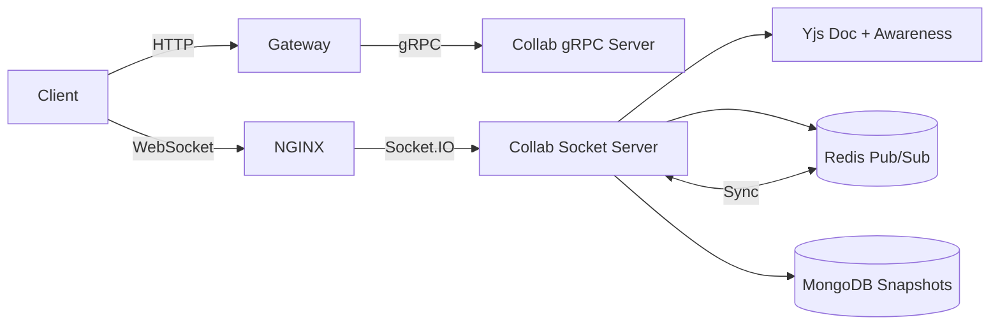
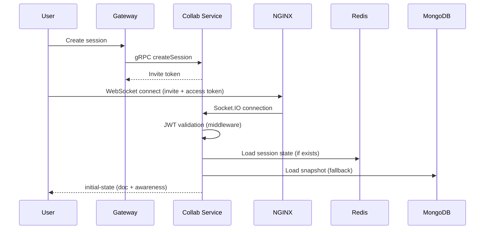
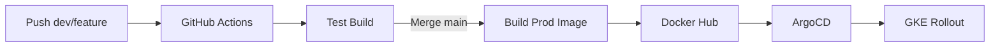

# Codex Collab Service

The **Collab Service** is the real‑time collaboration engine of the Codex platform. It provides shared code editing, multi‑cursor awareness, chat and session state synchronization using **Socket.IO**, **Yjs**, **Redis Pub/Sub**, and **MongoDB snapshots**. The service is horizontally scalable and designed to maintain consistent session state across multiple instances.

It exposes:

* A **gRPC server** for session lifecycle management (invite link generation, stats)
* A **WebSocket (Socket.IO) server** for real‑time collaboration

All external access goes through the **Gateway** and **NGINX Ingress**.

---

## 1. Service Overview

The Collab Service is responsible for:

* Real‑time shared code editing using **Yjs**
* Multi‑cursor presence and awareness
* Session‑scoped chat messaging
* Horizontal scaling with state synchronization
* Session recovery and durability via snapshots
* Secure session access using JWT‑based Socket.IO middleware

This service is stateful by design but engineered to survive pod restarts, network partitions and Redis outages.

---

## 2. Responsibilities

### Core Responsibilities

* Create collaboration sessions via gRPC
* Generate and validate invite tokens
* Accept WebSocket connections via Socket.IO
* Authenticate every socket connection using JWT
* Manage Yjs documents and awareness per session
* Synchronize document and awareness updates across instances
* Persist snapshots periodically to Redis and MongoDB
* Restore sessions from snapshots on reconnect or failure
* Support chat and metadata updates within sessions

### Not Responsible For

* HTTP APIs (handled by Gateway)
* Code execution or judging
* Authentication issuance (tokens are validated only)

---

## 3. High‑Level Architecture



---

## 4. Session Lifecycle Flow



---

## 5. Real‑Time Collaboration Model

### Yjs Document & Awareness

* Each session maintains:

  * One **Y.Doc** for shared code state
  * One **Awareness** instance for cursor and user presence
* Both client and server maintain local Yjs state
* Updates are CRDT‑based and conflict‑free

### Horizontal Scaling

* Socket.IO uses **Redis Adapter** to broadcast socket events
* Yjs updates are additionally published via **Redis Pub/Sub**
* Each instance applies remote updates with guarded origins to prevent loops

---

## 6. Snapshot & Recovery Strategy

### Redis (Hot State)

* Full Yjs document snapshots saved every few seconds
* Short TTL for fast recovery
* Used for healing missing packets and pod restarts

### MongoDB (Cold Persistence)

* Periodic and final snapshots stored durably
* Used when Redis is unavailable
* Guarantees session recovery even during cascading failures

---

## 7. Security Model

* Session creation only via Gateway → gRPC
* WebSocket connections require:

  * Invite token (session‑scoped)
  * Access token (user identity)
* Tokens validated in Socket.IO middleware
* Unauthorized sockets are rejected before joining rooms

---

## 8. Folder Structure (Simplified)

```
src/
  config/            # db, redis, socket, DI, kafka
  adapters/          # socket / redis adapters
  gRPC/              # gRPC server + handlers
  services/          # session business logic
  db/                # mongo models + repositories
  providers/         # redis cache provider
  utils/             # auth, logging, errors
  types/             # shared types
  index.ts           # service bootstrap
```

---

## 9. Observability

### Logging

* Structured logs via Pino
* Session‑scoped metadata (sessionId, userId)

### Tracing

* Socket lifecycle events
* Redis Pub/Sub operations
* MongoDB snapshot operations

---

## 10. CI/CD Pipeline



* Feature/dev branches trigger validation builds
* Main branch merge triggers production image push
* ArgoCD handles deployment automatically

---

## 11. Local Development

Install dependencies:

```
npm install
```

Run locally:

```
npm run dev
```

Build image:

```
docker build -t codex/collab-service .
```

---

## 12. License

MIT
